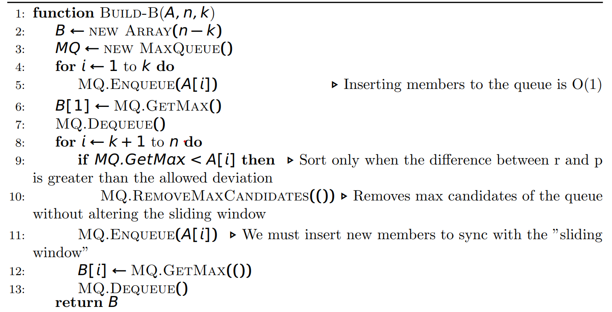

רעיון:

הבחנה - ישנו "חלון הזזה" ממנו נוכל לבחור מקסימוםעבור כל איבר ל B.

לכן, ה-ADL שבו נרצה להשתמש, יצטרך להיבנותבזמן ליניארי או פחות, ושמירה עליו לאורך בניין B

תתקיים בזמן קבוע.

- למטרות אלה אנו יכולים להשתמש בתור מקסימום, מהסיבות הבאות:

1. לבניית התור יש עלות ראשונית שלΘ(k)

2. קבלת המקסימום הואΘ(1)

3. הסרת החבר הוותיק ביותר בתור ייקח זמן קבוע

אלגוריתם

ניתוח זמן ריצה:

1. בניית MQ מתבצעת ב-Θ(k)

2. איטרציה על k + 1...n מתבצעת ב-Θ(n − k)

• MQ.GetMax, MQ.Dequeue ו-MQ.Enqueue נעשים כולם ב-Θ(1)

• MQ.RemoveMaxCandidates() מוגבל בין Θ(1) ל-Θ(k)

במקרה הגרוע ביותר יקרא MQ.RemoveMaxCandidates() כאשר יש לו איברים Θ(k)

לאחר מכן ל-MQ יש 0 חברים.

בהנחה שאנו קוראים לMQ.RemoveMaxCandidates() x פעמים בסך הכל.

נבדוק מתי Θ(x×MQ.RemoveMaxCandidates()) הוא הגבוה ביותר (המקרה הגרוע ביותר).

הבחנה: xו-k הן פונקציות הפוכות, והכפל שלהן מביא ל-Θ(n)

לפיכך האלגוריתם כולו פועל בזמן ליניארי כנדרש.

